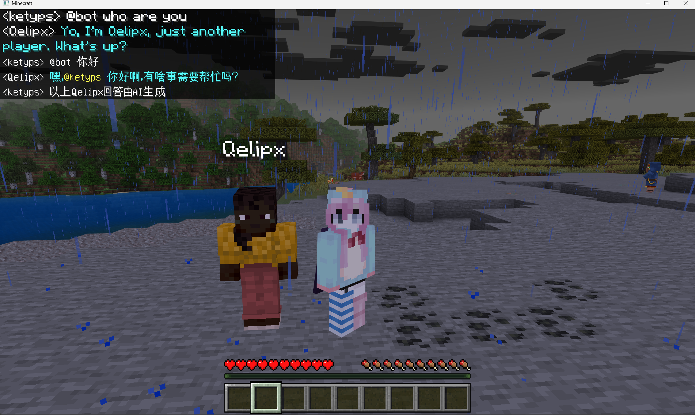
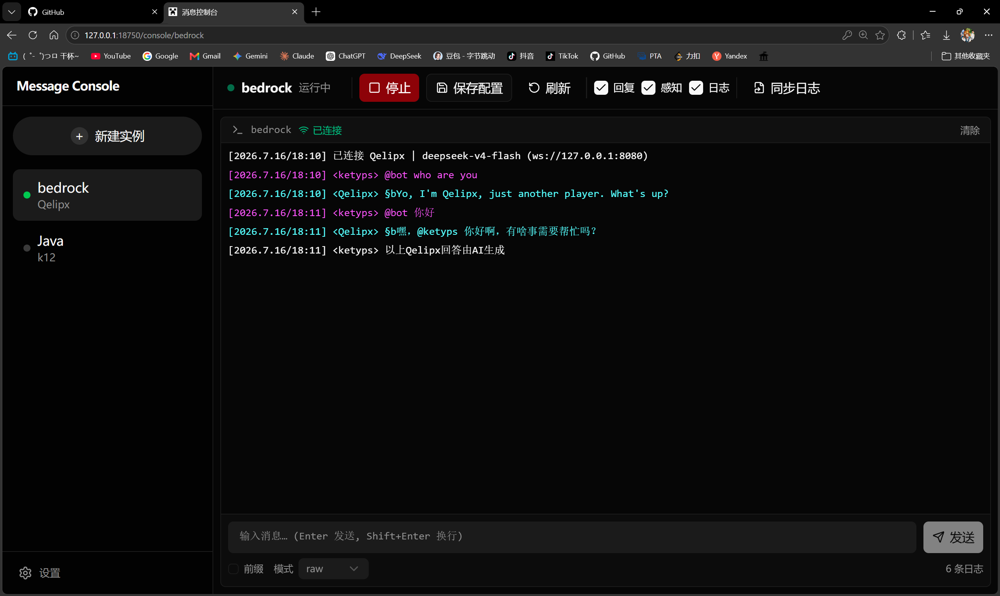
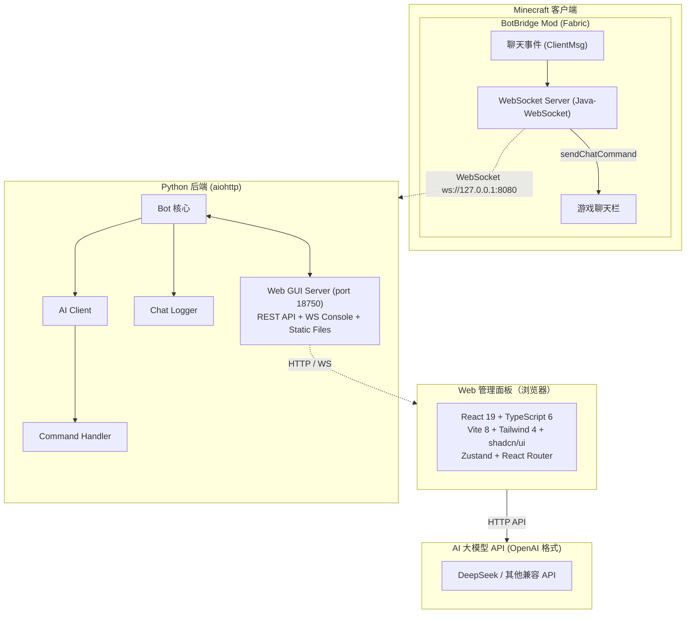

# Minecraft 智能聊天机器人

> 一个基于大模型（OpenAI 格式 API）的 Minecraft AI 聊天机器人系统。  
> 通过 Fabric 客户端 Mod 桥接游戏聊天与 AI，提供 Web 管理面板进行多实例管理。  
> **仅限个人学习与二次开发参考，禁止任何形式的商业化使用。**

---

<p align="center">
  
  <br/><br/>
  <em>游戏内 AI 聊天演示</em>
</p>

<p align="center">
  
  <br/><br/>
  <em>Web 管理面板控制台对照</em>
</p>

---

## 快速导航

- [使用方法](#一使用方法)
  - [环境要求](#环境要求)
  - [安装与启动](#安装与启动)
  - [快速开始](#快速开始)
- [技术栈](#二技术栈)
  - [整体架构](#整体架构)
  - [技术详情](#技术详情)
- [通信协议](#三通信协议)
  - [WebSocket 协议（Mod ↔ Python Bot）](#websocket-协议mod--python-bot)
  - [数据流](#数据流)
- [开发指南](#四开发指南)
  - [项目结构](#项目结构)
  - [本地开发](#本地开发)
  - [打包构建](#打包构建)
- [许可与声明](#五许可与声明)

---

## 一、使用方法

### 环境要求

| 组件 | 要求 |
|------|------|
| **Minecraft 客户端** | **1.21.5+**（仅测试过 1.21.5，Mod 使用 Fabric 标准 API，理论上未改接口的版本均可使用）；基岩版服务器可配合 [ViaFabricPlus](https://github.com/ViaVersion/ViaFabricPlus) 正常使用 |
| **Minecraft 服务端** | 任意支持 1.21.5 客户端的服务器（原版、Paper、Spigot 等均可） |
| **Fabric Loader** | **≥ 0.19.3** |
| **Fabric API** | **≥ 0.128.2+1.21.5**（必须安装） |
| **Java** | **≥ 21**（运行 Minecraft 和 BotBridge Mod 需要） |
| **Python** | **≥ 3.10**（运行后端服务需要） |
| **操作系统** | Windows 10/11（主程序打包为 Windows exe，Python 端亦可跨平台） |
| **AI API** | 兼容 OpenAI 格式的 API Key（默认 DeepSeek，可自行替换端点） |

### 目录结构说明

项目由三个独立组件组成，**需要同时运行才能正常工作**：

```
mc_ai_bot/
├── MessageConsole.exe       # [主程序] Web 管理面板 + Bot 后端 (PyInstaller 打包)
├── botbridge-0.1.0.jar      # [Mod] Fabric 客户端 Mod，桥接游戏与 Bot
└── instances/                # 实例配置文件夹（含 API Key，不会提交到 Git）
```

### 安装与启动

#### 第一步：安装 Minecraft Mod

1. 安装 **Fabric Loader 0.19.3+**（从 [Fabric 官网](https://fabricmc.net/use/) 下载安装器）
2. 将 **Fabric API**（`fabric-api-0.128.2+1.21.5.jar`）放入 `.minecraft/mods/`
3. 将 **botbridge-0.1.0.jar** 放入 `.minecraft/mods/`
4. 启动 Minecraft（使用 Fabric 版本），Mod 会自动启动 WebSocket 服务
   - 默认监听 `ws://127.0.0.1:8080`
   - 可在 `.minecraft/config/botbridge.json` 中修改端口和地址

#### 第二步：运行主程序

**方式一：直接运行（推荐）**

从 [Releases](https://github.com/ketyps/mc-console-bridge/releases) 下载以下两个文件放到同一目录：

| 文件 | 说明 |
|------|------|
| `mc-console-bridge-v1.0.0.zip` | 主程序，解压后双击 `bot/MessageConsole.exe` 启动 |
| `botbridge-0.1.0.jar` | Fabric Mod，放入 `.minecraft/mods/` |

> **⚠️ 安全提示**：`MessageConsole.exe` 由 PyInstaller 打包，无数字签名，Windows 可能会弹出 SmartScreen 警告（"Windows 已保护你的电脑"）。这是正常现象，点击 **"仍要运行"** 即可。如不放心，可前往 Windows 安全中心 → 病毒和威胁防护 → 管理设置 → 排除项，添加信任目录。也可选择下方的 Python 源码运行方式自行审查代码后启动。

**方式二：Python 源码运行**

```bash
# 1. 安装依赖
pip install -r requirements.txt

# 2. 创建实例
python manage.py create 我的服务器

# 3. 编辑实例配置
# 编辑 instances/我的服务器/.env，填入 API Key

# 4. 启动 Web 管理面板
python main_gui.py

# 5. 浏览器访问 http://127.0.0.1:18750
```

#### 第三步：连接与使用

1. **启动 Minecraft**，进入游戏（单人游戏或多人服务器均可）
2. **启动主程序**（`MessageConsole.exe` 或 `python main_gui.py`）
3. **在 Web 管理面板中**启动机器人实例
4. Bot 自动通过 WebSocket 连接 Mod，开始监听游戏聊天
5. 在游戏中使用 **触发词**（默认 `@bot`）唤醒 AI，例如：`@bot 你好！`

### 快速开始

```bash
# 查看所有实例
python manage.py list

# 创建新实例（支持中文名）
python manage.py create 生存服

# 从已有实例复制配置
python manage.py duplicate 生存服 创造服

# 删除实例
python manage.py delete 生存服
```

### 注意事项

- **Mod 和服务端需要同时运行**，缺一则无法工作
- 默认 WebSocket 端口为 `8080`，可在 Mod 配置文件 `/config/botbridge.json` 中修改
- Web 管理面板默认端口为 `18750`
- AI API Key 存放在 `instances/<名称>/.env` 中，请勿泄露

---

## 二、技术栈

### 整体架构



### 技术详情

| 层级 | 技术 | 说明 |
|------|------|------|
| **Minecraft Mod** | **Fabric** 0.19.3 + **Java 21** | 客户端侧 Mod，仅需 Fabric API 依赖 |
| Mod 通信 | **Java-WebSocket** 1.6.0 | 内嵌 WebSocket 服务端，无外部依赖 |
| 消息发送 | `sendChatCommand` / `sendChatMessage` | 通过 Minecraft 网络处理器发送 |
| **Python 后端** | **Python ≥ 3.10** | 核心业务逻辑 |
| Web 框架 | **aiohttp** ≥ 3.9 | 异步 HTTP + WebSocket 服务器 |
| WebSocket 客户端 | **websockets** ≥ 12 | 连接 Minecraft Mod |
| AI API 调用 | **aiohttp** | 异步 HTTP 调用大模型 API |
| 跨进程检测 | `ctypes` / `os.kill` | PID 文件 + 心跳检测 |
| **前端** | **React 19** + **TypeScript 6** | 声明式 UI |
| 构建工具 | **Vite 8** | 快速开发与构建 |
| 样式方案 | **Tailwind CSS 4** + **shadcn/ui** | 原子化 CSS + Radix UI 组件 |
| 状态管理 | **Zustand** 5 | 轻量状态管理 |
| 包管理 | **pnpm** | 依赖管理 |
| **打包** | **PyInstaller** | Python 后端打包为 Windows exe |
| Mod 发布 | **Fabric Loom** 1.10.5 | Gradle 构建发布 |

---

## 三、通信协议

> 协议详情供二次开发和集成参考。

### WebSocket 协议（Mod ↔ Python Bot）

Mod 在 Minecraft 客户端内启动一个 **WebSocket 服务端**，Python Bot 作为 **WebSocket 客户端**连接。

**默认连接：** `ws://127.0.0.1:8080`（可在 Mod 配置文件中修改）

#### 数据流向

```
游戏聊天消息 → Mod 监听 ClientReceiveMessageEvents
             → WebSocket 广播给 Python Bot
             → Python Bot 处理（AI 回复 / 自定义指令）
             → WebSocket 发送回复文本给 Mod
             → Mod 调用 sendChatCommand/sendChatMessage 发送到游戏
```

#### 消息格式

所有消息均为 **纯文本**（非 JSON），一行一条：

**Mod → Bot（游戏聊天转发）：**

```
玩家名发送的消息内容
```

不包含时间戳和发送者前缀，由 Python 端自行拼装。

**Mod → Bot（系统消息转发）：**

```
[System] 玩家加入了游戏
```

系统消息通过 `ClientReceiveMessageEvents.GAME` 事件转发。

**Bot → Mod（AI 回复发送到游戏）：**

```
你好！今天有什么可以帮你的？
```

纯文本，不带 `/me` 前缀。Python Bot 会根据 `SEND_MODE` 配置自动拼接前缀：

| `SEND_MODE` | 实际发送到游戏 | 效果 |
|-------------|---------------|------|
| `me`（默认） | `/me 你好！` | 动作消息（斜体显示） |
| `say` | `/say 你好！` | 说话消息 |
| `raw` | `你好！` | 纯文本（直接聊天栏） |
| `json` | `{"type":"chat","body":{"content":"你好！"}}` | JSON 协议 |

#### Mod 配置

配置文件位于 `.minecraft/config/botbridge.json`：

```json
{
  "host": "127.0.0.1",
  "port": 8080,
  "enabled": true
}
```

### 管理面板 WebSocket 协议

Web 前端的控制台通过 WebSocket 连接 Python 后端的 `/ws/console/<实例名>`，获取实时日志流。

**服务端 → 前端（日志消息）：**

```json
{
  "ts": "",
  "text": "玩家 bot: @bot 你好",
  "type": "info",
  "seq": 42
}
```

| 字段 | 类型 | 说明 |
|------|------|------|
| `ts` | string | 时间戳（保留字段，当前为空） |
| `text` | string | 日志文本 |
| `type` | string | 类型：`info` / `warn` / `error` / `raw` |
| `seq` | number | 递增序号 |

### REST API

后端提供 RESTful API 供前端管理实例：

| 方法 | 路径 | 说明 |
|------|------|------|
| GET | `/api/instances` | 列出所有实例 |
| POST | `/api/instances/create` | 创建实例 |
| POST | `/api/instances/rename` | 重命名实例 |
| POST | `/api/instances/delete` | 删除实例 |
| POST | `/api/instances/duplicate` | 复制实例 |
| POST | `/api/instances/{name}/start` | 启动机器人 |
| POST | `/api/instances/{name}/stop` | 停止机器人 |
| GET | `/api/instances/{name}/config` | 获取实例配置 |
| POST | `/api/instances/{name}/config` | 更新实例配置 |
| GET | `/api/instances/{name}/runtime_state` | 获取运行状态 |
| POST | `/api/instances/{name}/runtime_state` | 更新运行状态 |

---

## 四、开发指南

### 项目结构

```
mc_ai_bot_modular/
├── main.py                 # Minecraft 机器人核心（WebSocket 连接 + 消息处理）
├── main_gui.py             # aiohttp Web 服务器 + REST API + 控制台 WebSocket
├── manage.py               # 实例管理 CLI（创建/删除/复制/列出/编辑）
├── ai_client.py            # AI HTTP 客户端（调用大模型 API）
├── instance.py             # BotInstance 数据模型与文件管理
├── command_handler.py      # 自定义指令系统（JSON 配置文件驱动）
├── config.py               # 路径工具（开发/打包模式路径切换）
├── utils.py                # 文本清理、命令构建工具函数
├── logger.py               # 聊天日志记录器（HTML/TXT 双格式）
├── ws_test_server.py       # WebSocket 测试服务端（供调试使用）
├── requirements.txt        # Python 运行依赖
├── requirements-dev.txt    # Python 开发依赖（pytest）
├── LICENSE                 # PolyForm Noncommercial 1.0.0
├── .env.example            # 环境变量模板
├── frontend/               # React 前端
│   ├── src/
│   │   ├── App.tsx         # 主应用组件
│   │   ├── store/          # Zustand 状态管理
│   │   ├── hooks/          # 自定义 Hooks（useConsoleWS 等）
│   │   ├── components/     # UI 组件（shadcn/ui）
│   │   ├── types/          # TypeScript 类型定义
│   │   ├── api/            # API 调用
│   │   └── lib/            # 工具函数
│   ├── package.json        # 依赖（pnpm）
│   └── vite.config.ts      # Vite 配置
├── mod/                    # Fabric Mod
│   ├── src/main/java/com/ketyps/botbridge/
│   │   ├── BotBridge.java         # Mod 主入口
│   │   ├── BotBridgeServer.java   # WebSocket 服务器
│   │   └── BotBridgeConfig.java   # Mod 配置
│   ├── build.gradle               # Gradle 构建（Fabric Loom）
│   ├── gradle.properties          # 版本配置
│   └── fabric.mod.json            # Fabric Mod 元数据
├── tests/                  # 测试
├── scripts/                # 工具脚本
└── README.md               # 本文件
```

### 本地开发

```bash
# Python 后端
pip install -r requirements.txt
python main_gui.py          # 启动开发服务器（默认 18750 端口）

# 前端开发
cd frontend
pnpm install
pnpm dev                    # 启动 Vite 开发服务器（HMR）

# Mod 开发
cd mod
./gradlew build             # 构建 Mod
# 构建产物在 mod/build/libs/botbridge-0.1.0.jar
```

开发模式下前端使用 Vite 代理，将 `/api/*` 和 `/ws/*` 请求转发到 Python 后端（18750 端口），配置见 `frontend/vite.config.ts`。

### 打包构建

```bash
# 前端构建
cd frontend
pnpm build                  # 输出到 frontend/dist/
# 构建产物由 PyInstaller 一并打包

# 主程序打包（PyInstaller）
# 将 frontend/dist 和所有 Python 文件打包为单 exe
# 详见 release 脚本

# Mod 构建
cd mod
./gradlew build             # 输出到 mod/build/libs/botbridge-0.1.0.jar
# 使用 Gradle wrapper，无需手动安装 Gradle
```

---

## 五、许可与声明

### 许可协议

本项目源码基于 **PolyForm Noncommercial 1.0.0** 发布（见 `LICENSE` 文件），专为非商业使用场景设计：

- ✅ **允许** 个人学习、研究、二次开发
- ✅ **允许** 非商业用途的个人或组织使用
- ❌ **禁止** 任何形式的商业用途，包括但不限于：
  - 直接出售本软件或其修改版本
  - 将本软件作为商业服务的一部分提供
  - 在商业服务器上使用本软件牟利
  - 打包本软件用于商业分发

### 免责声明

- 本软件仅供学习交流使用，使用者需遵守当地法律法规
- AI 生成内容不代表本项目观点，使用者需对 AI 的行为负责
- 使用本软件可能违反某些 Minecraft 服务器的规则，请自行确认
- 本项目使用的 AI API 服务（如 DeepSeek）由第三方提供，请遵守其使用条款

### 致谢

- [Fabric MC](https://fabricmc.net/) — Mod 开发框架
- [Java-WebSocket](https://github.com/TooTallNate/Java-WebSocket) — Mod WebSocket 库
- [aiohttp](https://docs.aiohttp.org/) — Python 异步 Web 框架
- [React](https://react.dev/) / [Vite](https://vite.dev/) / [Tailwind CSS](https://tailwindcss.com/)
- [shadcn/ui](https://ui.shadcn.com/) — UI 组件库
- [DeepSeek](https://deepseek.com/) — AI 大模型 API

---

> 项目链接：[GitHub](https://github.com/ketyps/mc-console-bridge)  
> 如需反馈问题或建议，请提交 Issue。
